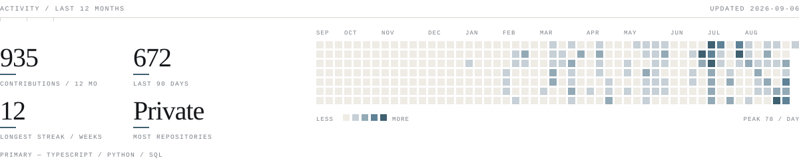

<picture>
  <source media="(prefers-color-scheme: dark) and (max-width: 600px)" srcset="assets/header-mobile-dark.svg">
  <source media="(max-width: 600px)" srcset="assets/header-mobile.svg">
  <source media="(prefers-color-scheme: dark)" srcset="assets/header-dark.svg">
  
</picture>

[aminhashemi.com](https://aminhashemi.com) &nbsp;·&nbsp; [LinkedIn](https://www.linkedin.com/in/aminhashemi/) &nbsp;·&nbsp; [aminhashemi@live.com](mailto:aminhashemi@live.com)

## Build · Ship · Explore

```
BUILD                  SHIP                  EXPLORE
AI-native products     Talero ATS            Multi-agent systems
Developer tools        Talero Talents        RAG · retrieval
Automation systems     Z17                   Edge infrastructure
```

## Selected projects

**Talero ATS** <sub>· live</sub><br>
Applicant tracking and assessment that reads every candidate in full, so strong ones are not filtered out early.<br>
`TypeScript · Node.js · Python · FastAPI · PostgreSQL · Claude`

**Talero Talents** <sub>· live</sub><br>
Data visualisation that surfaces personality traits and shows users where their skills can improve.<br>
`React · TypeScript · Supabase · PostgreSQL · Stripe`

**Z17** <sub>· live</sub><br>
Clinic site migrated from Joomla to edge rendering.<br>
`React · Vite · Cloudflare Workers`

**Akademisk Kvart** <sub>· volunteer</sub><br>
Student housing listings for Stockholm.<br>
`React · TypeScript · AWS · Vercel`

<sub>Most source is private. Case studies → [aminhashemi.com](https://aminhashemi.com)</sub>

## Tools

```
Languages       TypeScript · JavaScript · Python · PHP · SQL · HTML · CSS
AI              Claude Code · OpenAI · Gemini · LangGraph · Qdrant
Frontend        React · Next.js · Vite · Tailwind
Backend         Node.js · FastAPI · PostgreSQL · Redis
Infrastructure  Cloudflare · AWS · Google Cloud · Nginx · Docker
Tooling         GitHub Actions · Cursor · Codex · n8n · Supabase · Git
```

## Activity

<picture>
  <source media="(prefers-color-scheme: dark) and (max-width: 600px)" srcset="assets/activity-mobile-dark.svg">
  <source media="(max-width: 600px)" srcset="assets/activity-mobile.svg">
  <source media="(prefers-color-scheme: dark)" srcset="assets/activity-dark.svg">
  
</picture>


<sub>Stockholm / Linköping — available for AI engineering and product systems.</sub>
