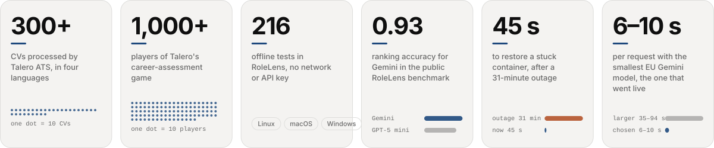
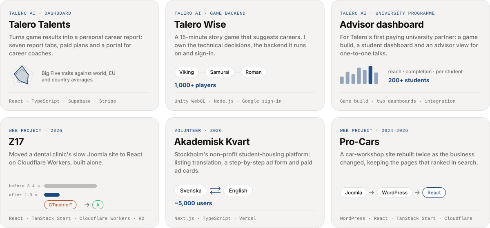

<a href="https://aminhashemi.com">
  <picture>
    <source media="(prefers-color-scheme: dark) and (max-width: 600px)" srcset="assets/hero-narrow-dark.svg">
    <source media="(max-width: 600px)" srcset="assets/hero-narrow.svg">
    <source media="(prefers-color-scheme: dark)" srcset="assets/hero-dark.svg">
    
  </picture>
</a>

  <a href="https://aminhashemi.com"><b>Portfolio and case studies</b></a> &nbsp;·&nbsp;
  <a href="https://www.linkedin.com/in/aminhashemi/">LinkedIn</a> &nbsp;·&nbsp;
  <a href="mailto:aminhashemi@live.com">aminhashemi@live.com</a>

### Two systems I built end to end

<a href="https://aminhashemi.com/projects/talero-ats">
  <picture>
    <source media="(prefers-color-scheme: dark) and (max-width: 600px)" srcset="assets/talero-ats-narrow-dark.svg">
    <source media="(max-width: 600px)" srcset="assets/talero-ats-narrow.svg">
    <source media="(prefers-color-scheme: dark)" srcset="assets/talero-ats-dark.svg">
    
  </picture>
</a>
  
<a href="https://github.com/Aminhashemi-su/RoleLens">
  <picture>
    <source media="(prefers-color-scheme: dark) and (max-width: 600px)" srcset="assets/rolelens-narrow-dark.svg">
    <source media="(max-width: 600px)" srcset="assets/rolelens-narrow.svg">
    <source media="(prefers-color-scheme: dark)" srcset="assets/rolelens-dark.svg">
    
  </picture>
</a>

### From production

<picture>
  <source media="(prefers-color-scheme: dark) and (max-width: 600px)" srcset="assets/numbers-narrow-dark.svg">
  <source media="(max-width: 600px)" srcset="assets/numbers-narrow.svg">
  <source media="(prefers-color-scheme: dark)" srcset="assets/numbers-dark.svg">
  
</picture>

### Things that broke, and what I changed

The model is the easy part. These are the moments that decided how I build.

| Where | What broke | What I changed |
|:--|:--|:--|
| Talero ATS | A deploy left the API hung for **31 minutes**. | Health checks and a watchdog. A stuck container now comes back in **about 45 s**. |
| Talero ATS | A scanned CV with zero readable characters still got a score of **48**, and nobody was warned. | One Gemini call now reads the PDF directly, and an empty or unreadable file **stops with an error**. |
| Talero ATS | The two larger EU Gemini models took **35–94 s** and gave near-identical scores. | Tested all three on real CVs. The smallest took **6–10 s** and was the only one that told candidates apart, so it went live. |
| Talero ATS | An empty setting put production into a crash loop. | Two pre-deploy checks now stop a release before it starts. |
| RoleLens | A provider answered **200 OK** with valid JSON for only **3 of 20** jobs. | Every job must come back exactly once or it stays queued. The provider was dropped. |
| RoleLens | Two identical re-judgements disagreed on **6 of 40** matches. | Jobs near the line are judged twice and decided on the average. |
| RoleLens | Replaying stored AI answers found **two bugs** in my own Swedish-language rules. | Rule changes are replayed through the real decision code before every release. |
| RoleLens | Keyword search found **2 of 20** relevant roles. | The full JobStream feed replaced search; ranking decides what gets read. |

### More work

<a href="https://aminhashemi.com">
  <picture>
    <source media="(prefers-color-scheme: dark) and (max-width: 600px)" srcset="assets/projects-narrow-dark.svg">
    <source media="(max-width: 600px)" srcset="assets/projects-narrow.svg">
    <source media="(prefers-color-scheme: dark)" srcset="assets/projects-dark.svg">
    
  </picture>
</a>

Case studies: <a href="https://aminhashemi.com/projects/talero-talents-dashboard">Talero Talents</a> · <a href="https://aminhashemi.com/projects/z17">Z17</a> · <a href="https://aminhashemi.com/projects/akademisk-kvart">Akademisk Kvart</a> · <a href="https://aminhashemi.com/projects/pro-cars">Pro-Cars</a> · <a href="https://aminhashemi.com/projects/nibela">Nibela</a> · <a href="https://aminhashemi.com/projects/talero-ai">Talero AI</a>. RoleLens is public; the other code lives in private repositories.

### The stack, layer by layer

<picture>
  <source media="(prefers-color-scheme: dark) and (max-width: 600px)" srcset="assets/stack-narrow-dark.svg">
  <source media="(max-width: 600px)" srcset="assets/stack-narrow.svg">
  <source media="(prefers-color-scheme: dark)" srcset="assets/stack-dark.svg">
  
</picture>

Every day: Claude Code · Codex · Cursor · Git · Figma

### Right now

- Looking for a **full-time role in Sweden** as an AI engineer or full-stack developer. Available immediately.
- **MSc Strategic Information Systems Management** at Stockholm University, graduating June 2027.
- Learning Swedish: **A2** today, **B1** exam in December 2026.

Stockholm, Sweden · Right to work in Sweden, no visa sponsorship needed · <a href="mailto:aminhashemi@live.com">aminhashemi@live.com</a> Every image on this page is drawn by <a href="scripts/build.mjs">scripts/build.mjs</a> from one file of facts. No stats widgets, no trackers, and things only move where data moves.
